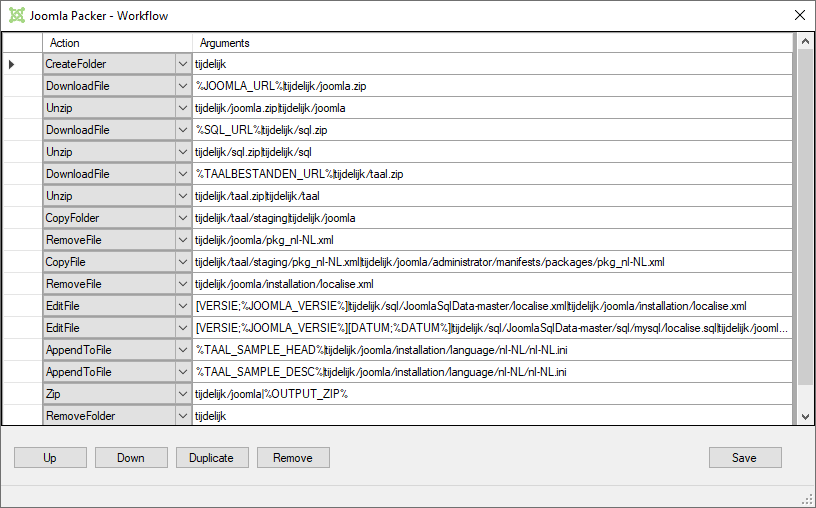

# Joomla packer

Joomla packer is created by Joomla!NL (https://www.joomlanl.nl/) for creating a Dutch Joomla distribution package. It is created in mind with changing dependencies, so the workflow of the application is changeable and expandable from the user interface. 

## How to use the workflow editor

Workflow editor can make use of the variables, which can be registered at the variables editor. This is done to make it more manage able for the user. 

The editor works with rows, and starts at the top ends at the bottom. You can change order by using the up and down button, or press alt + u for up and alt + o for down.

## What are the expected arguments

We make use of pipe symbols as a separator for the arguments, with EditFile you can define collections e.g:

EditFile - \[Foo;Bar\]\[Test;123\]|test.txt

In test.txt, Foo will be replaced with Bar and Test will be replaced with 123.

**Expected are the following:**  

- CopyFile - sourceFile|destinationFile
- EditFile - [searchWordOrSentence;replaceWith]|editFile
- EditFile - [searchWordOrSentence;replaceWith]|editFile|saveAsFile

- AppendToFile - text|editFile

- RemoveFile - fileToRemove

- DowloadFile - url|saveAsFile

- CreateFolder - folderName

- CopyFolder - sourceFolder|destinationFolder

- RemoveFolder - folderName

- ClearAllInFolder - folderName

- Zip - sourceFolder|saveAsFile

- Unzip - zipFile|destinationFolder

---
*Joomla is a registered trademark of Open Source Matters, Inc. in the U.S. and/or other countries. Joomla packer is not affiliated with or endorsed by Open Source Matters, Inc.*
